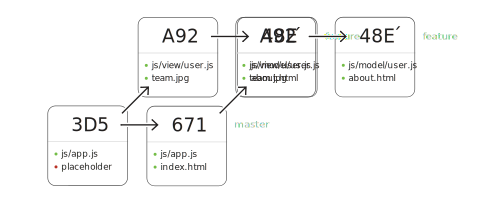


### Understanding Git, navigating history




1. Understand the way Git preserves history and data objects
2. Utilize shorthand for navigation commit history


#### Details
* SHA1 as the core hashing algorithm
* Directed acyclic graph of commits
* Composed of three fundamental object typs
  * Commit
  * Tree
  * Blob
* Built-in data integrity from commit, tree, blob

##### Treeish & commitish
* Simple ways of describing history points
* Easier-to-describe and understand numerically
* Application of patterns works on [GitHub](https://help.github.com/articles/comparing-commits-across-time)

```
HEAD
HEAD^^
HEAD~2
HEAD@{one.day.ago}
HEAD@{today}
```

##### Navigating history
* Log is like a search engine.
* Search for person, time, change, contents, message.
* Dramatically narrows human search time when using `log` search filters.

```bash
$ git log --author [author-name]
$ git log --since [integer].days.ago
$ git log -S [string-in-patch]
$ git log -G [regex-pattern-in-patch]
$ git log --grep=[regex-in-message]
$ git log --diff-filter=[A|M|D]
$ git log --follow --stat --diff-filter=[A|M|D] -- <filename>
$ git log --oneline --left-right master..other
$ git log --oneline --left-right master...other
$ git name-rev [commit-ref]
```

#### Videos
<iframe src="//player.vimeo.com/video/95811891" width="500" height="350" frameborder="0" webkitallowfullscreen mozallowfullscreen allowfullscreen></iframe>



### Collaborating on change & releases







#### Details

##### Branching patterns, best practices
* Branch by feature
 Compatibility with Pull Requests
* GitHub Flow
    * [How GitHub Develops](https://github.com/blog/919-how-github-develops)
    * [GitHub Flow blog post](http://scottchacon.com/2011/08/31/github-flow.html)
    * Works well with Pull Requests when one-layer deep
    * Think of features much smaller than typical
* git-flow
    *  Made popular on Git by Vincent Driessen and his NVIE site
    * [Git-Flow: A Successful Branching Model](http://nvie.com/posts/a-successful-git-branching-model/)
    * [Git-Flow Source](https://github.com/nvie/gitflow)
    * Too many levels?
    * GH prefers Simplest thing that works.
* Rebase before sharing (sending a Pull Request)
  * [Contributing to Spring Social](https://github.com/spring-projects/spring-social/wiki/Contributing)
  * [How To Merge Without Fear](http://blog.springsource.org/2010/12/21/git-and-social-coding-how-to-merge-without-fear/)
  * [What to do when things get complicated](http://blog.springsource.org/2011/07/18/social-coding-pull-requests-what-to-do-when-things-get-complicated/)

##### Cutting releases
* Why create a tag through the web UI?
* Not a branch HEAD. Points to a specific commit.
* Attaching binaries to releases (Web UI and API)
* Tag with message (defaults to annotated)
* Force existing tag to new ref
* Delete a tag
* `$ git describe` to name the most recent reachable tag
* Tag types (reference, annotated, signed)
* Deleting a tag locally
* Deleting tag on a remote
* Version numbers
  * `major.minor.fix`
  * [Semantic versioning](http://semver.org)

Generating a lightweight reference tag is simple:

```shell
$ git tag [TAGNAME] [commit]
```

Annotated tags generate a complete data object in the Git repository, storing the author, a timestamp, a specific SHA1 reference, and the option of signing work with a GPG key.

```shell
$ git tag -a [TAG_NAME] [commit|branch]
$ git tag -a -m [TAG_NAME] [commit|branch]
```

The `tag` command offers a number of ways to understand what it represents, ways of replacing it, and even the option of eliminating it if necessary.

```shell
$ git tag -s -m[message] [TAGNAME]
$ git tag -f [TAGNAME]
$ git tag -d [TAGNAME]
$ git describe
$ git describe [SHA]
$ git tag -d 12345
$ git push origin :[tag-name-to-delete]
```



### Ignoring & cleaning up files



1. Setup ignore patterns to prevent accidental versioning
2. Clean working directory of untracked files
3. Tidy working directory of any `.gitignore` matched files


#### Details
##### Repository-specific ignores
* Ignoring files from repo & system level
* Reviewing ignored files with custom command
* Forcing a staging of ignored files

```shell
$ vi .gitignore
```

##### System-wide ignores
```shell
$ git config core.excludesfile [path]
```

##### Listing ignored files
```shell
$ git config alias.show-ignored \
    "ls-files --exclude-standard
    --others --ignored"
```

##### Staging ignored files
```shell
$ git add -f [path]
```

##### Removing unwanted files
* Purge untracked in working dir
* for directories
* for removing ignored files (useful for tidying build artifacts)

```
$ git clean -f
$ git clean -fd
$ git clean -fx
```

#### Video
<iframe src="//player.vimeo.com/video/99804597" width="500" height="350" frameborder="0" webkitallowfullscreen mozallowfullscreen allowfullscreen></iframe>


### Mastering shortcuts & efficiencies






#### Details
##### Shortcuts
* Shortcuts to multiple steps
* Useful customized commands

Add and commit along with the commit message:

```shell
$ git commit -a -m"[message]"
```

Commit, amend, and provide the commit message:

```shell
$ git commit --amend -m "[updated message]"
```

Checkout and create a branch:

```shell
$ git checkout -b [branch] [base]
```

##### Temporary changes
* Name your stash
* List stashes
* Use specific stashes

```shell
$ git stash
$ git stash save "<description>"
$ git stash --include-untracked
$ git stash list
$ git stash pop <name>
$ git stash drop <name>
$ git stash apply
$ git stash clear
$ git stash -p
```

##### Isolating Work
* Version patches of large change sets
* Stage interactively on command line
* Revise to-be-committed patch

```bash
# Stage by patch
$ git add -p [file]

# Unstage by patch
git reset HEAD -p [file]
```

##### Avoiding repetitive conflicts
* *Re*use *re*corded *re*solution
* Preserves pre-image to simplify conflicts

```shell
$ git config rerere.enable true
```



### Using built-in GUIs






#### Details
* for staging, committing
* for browsing history
* Tcl/Tk based

```
$ git gui
$ gitk
$ gitk&
$ gitk --all
```



### Capturing pieces of history






#### Details
* Reusing small pieces of code with `cherry-pick`
* Why use `cherry-pick` instead of `merge`?
* What happens when you `cherry-pick`?
* Maintaining `author` and `committer` fields
* Tracing any cherry-picks with `-x` commit message metadata
* `-x` metadata hyperlinked on GitHub
* `$ git cherry` to view absent commits
* Can include cherry-pick during rebase interactive

```shell
# Generate new commit on current branch
# with patch of specified commit

$ git cherry-pick [commit]
```

##### Identifying incorporated commits
```shell
# List branches containing same patch

$ git cherry [comparison-branch]
```

##### Retrieving paths from existing commits
```shell
# Stage the versioned file from a specific commit
git checkout [commit] -- [path]
```



### Rewriting and crafting history









#### Details
##### What is rebase?
* Branch Preparation
* Rebasing __is not__ merging
* Conflicts can occur
* Resolution is simple
* Small variation to merge conflict

##### Rebasing a branch
Re-playing branch-specific commits against a base is the most common use case for rebase.

```shell
$ git checkout <featurebranch>
$ git rebase master
```

##### Rebase configuration
The behavior of `pull` can be configured to replay all local commits ahead of the incoming upstream ones.

```shell
$ git config pull.rebase true
```

##### Handling conflicts
Resolving a conflict during a rebase requires intervention, and then signaling that the conflict is resolved.

```shell
$ git add [conflicting-file]
$ git rebase --continue
```

##### Reordering History

* Reorder commits
* Rewrite history entirely
* Discard commits
* Revise/edit commits
* Safe patterns for rebasing local history
* Verbs (cheat sheet of commands)

```bash
$ git rebase -i <REF>
```

##### Reordering all commits on a branch

```bash
$ git rebase -i [remote]/[branch]
```

##### Rebase markers
Automatically arrange commits and rebase with `fixup!` and `squash!` message prefixes

```bash
$ git rebase -i --autosquash [ref]
```



### Reviewing & synchronizing






#### Details
##### Reviewing remote branches
* PRs to horizontal contributors
* PRs multiple levels up
* Converting issues to PRs
* PRs as Issues with code
* Automatic closing of PRs by local merges
* Merges must be _made by recursive_
* Retrieving PRs locally to resolve conflicts
(without locally merging to target branch)

```shell
$ git ls-remote origin
$ git fetch origin refs/pull/1/head

$ git show FETCH_HEAD
$ git merge --no-commit --no-ff FETCH_HEAD
```

##### Examining remote branches
```shell
$ git remote -v
$ git remote show <remote-name>
$ git ls-remote
$ git branch -vv
```

##### Retrieving arbitrary commits
To merely retrieve the commits to `FETCH_HEAD`:

```shell
$ git fetch [remote] [pull-request-namespace]
```

To merge the retrieved commits into a branch:

```shell
$ git pull [remote] [pull-request-namespace]
```

##### Leveraging FETCH_HEAD
```shell
$ git fetch <URL> <branch>
$ git checkout FETCH_HEAD
$ git branch <newbranchname> FETCH_HEAD
```

##### What are refspecs?
* Specification for retrieval and pushing
* Implied on fetch, pull, and push
* Altered by option switches like `--tags`
* Stored in `.git/config`
* Ability to retrieve Pull Request branches

##### Refspec examples
```
# Source and destination refspecs
$ git fetch [repo-url] [source]:[destination]

$ git fetch [repo-url] master
 * branch     master     -> FETCH_HEAD

$ git fetch origin refs/pull/1/head
 * branch     refs/pull/1/head -> FETCH_HEAD
```

##### Refspec to retrieve pull requests
```
$ git config --add remote.[upstream].fetch "+refs/pull/*/head:refs/remotes/[upstream]/pull/*"
```



### Filtering histories & externalizing dependencies



1. Separate versioned content in a repository into a separate one
2. Clean up unwanted history repository-wide with `filter-branch`
3. Incorporate external repositories as dependencies with `submodule`


#### Details
```shell
$ git filter-branch
    --subdirectory-filter [dir]
    -- --all
```

```shell
$ git filter-branch --index-filter
    'git rm --cached
    --ignore-unmatch [file]' HEAD
```

##### Adding submodules
Add a separate repository as a subdirectory:

```
$ git submodule add [repo-url] [folder]
```

##### Using submodules
For a freshly cloned repository with submodules

```
# Step-by-step
$ git submodule init
$ git submodule update

# Single process with option switches
$ git submodule update --init --recursive
```



### Signing work






#### Details
##### Configuring GPG
```shell
$ gpg --list-keys
pub   1024D/627CBB21 2014-08-01
uid                  Matthew McCullough

# Use 627CBB21 as the signing key's ID
$ git config --global user.signingkey [ID]
```

##### Using GPG signatures on commits
```shell
$ git commit --signoff
# or the shorthand invocation...
$ git commit -S

$ git log --show-signature
```

##### Using GPG signatures on tags
```shell
$ git merge --verify-signatures
```

```shell
$ git tag -s [tag-name] [commit]

$ git tag -v [tag-name]
```



### Using GitHub CLI and the API






#### Details

##### Command line interface
* Uses the API for interfacing with your repos
* Stores OAUTH token, credentials
* Highly efficient for power-users
* Hub and GH merging into one project

```shell
# Create a new public repository on your GitHub account
$ gh create

# Create a new private repository on your GitHub account
$ gh create -p

# Open a Pull Request for the current branch
$ gh pull-request

# Create a fork of the cloned repository on your GitHub Account
$ gh fork

# Launch a web browser with the branch comparison view
$ gh compare

# Launch a web browser to the repository home page
$ gh browse
```

##### The GitHub API

```shell
# Anonymous
$ curl <URL>

# Pass credentials on CLI
$ curl -u <user:password> <URL>

# Use .netrc file
$ curl -n <URL>
```

There are a number of libraries for interfacing with the GitHub API, all of which are available at [octokit.github.io](http://octokit.github.io/)



### Diff & merge tool






#### Details
* [Atom Merge Conflict plugin](https://atom.io/packages/merge-conflicts)
* [P4Merge](http://www.perforce.com/downloads/Perforce/20-User)
* Opendiff
* KDiff
* Kaleidoscope
* Vimdiff
* Meld

Difftool execution:

```
$ git difftool --tool-help
$ git config diff.tool <tool-name-in-config>
$ git config difftool.prompt false
$ git config difftool.<tool-name>.cmd "<path [args]>"
```

A sample `.gitconfig` file:

```
[diff]
    tool = p4merge
[difftool "p4merge"]
    cmd = "/Applications/p4merge.app/Contents/Resources/launchp4merge $LOCAL $REMOTE"
[difftool]
    prompt = false
```


Mergetool execution:

```
$ git config --global merge.tool p4mergetool

$ git config --global mergetool.p4mergetool.cmd "/Applications/p4merge.app/Contents/Resources/launchp4merge \$PWD/\$BASE \$PWD/\$REMOTE \$PWD/\$LOCAL \$PWD/\$MERGED"

$ git config --global mergetool.p4mergetool.trustExitCode false

$ git config --global mergetool.keepBackup false
```

A sample `.gitconfig` file:

```
[merge]
    tool = Kaleidoscope
[mergetool "p4mergetool"]
    cmd = " /Applications/p4merge.app/Contents/Resources/launchp4merge $PWD/$BASE $PWD/$REMOTE $PWD/$LOCAL $PWD/$MERGED"
    keepBackup = false
```



### Additional resources






#### Details
This course covers many advanced uses of Git and GitHub, and yet there is still more to explore. We've included some of the most useful resources for our students with insatiable appetites.

##### Advanced Git Videos
* [Advanced Git, presented at JavaZone](http://vimeo.com/49444883)
* [Mastering Advanced Git, O'Reilly video series](http://bit.ly/ogitvid2)
* [The Fringes of Git, Git internals video](http://www.youtube.com/watch?v=qh-R0-7Ii_U)

##### Tools
* [`gh`, GitHub command line utility](https://github.com/jingweno/gh)
* [oh-my-zsh, ZSH plugin framework](https://github.com/robbyrussell/oh-my-zsh)

##### Git Documentation
* [Git `man` page command documentation](https://www.kernel.org/pub/software/scm/git/docs/git.html)
