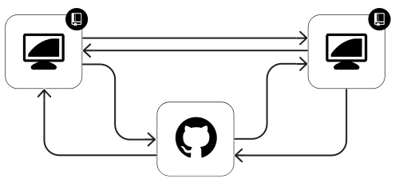

## Understanding version control

* Explain Git as the fundamental technology
* Describe GitHub as the collaboration platform
* Review distributed version control system
* Explore GUIs/graphical clients
* Distinguish distributed approach


* Verifying that Git is installed and operational can be done by requesting Git to display its current version using this command:
    ```shell
    $ git --version
    ```


## Surveying the GitHub platform

* Git repository hosting
* Code & Collaboration platform
* Issue tracking system
* Documentation distribution


### Feature overview
* Hosting repositories
* Collaborating on code, documents, text
* Controlling access & contributions
  * Permissions
  * Forks
  * Users
  * Organizations
* Tracking assignments, tickets, bugs
* Hosting supporting documentation (GH-Pages)
  * https://pages.github.com/
* Discovering trending technology (Explore)
  * https://github.com/explore
* Tracking favorite projects (Stars)
  * https://github.com/stars


### GitHub visualizations
* Comparing/Diff-ing
  * Code
  * Prose
  * Images
  * Maps
  * Spreadsheets
  * models
* Branch view
* Branch ahead/behind positions
* Network graph
* Activity graph

### GitHub Pages

* Web page for your repository
* Web page for your account
* Author, edit, launch from GitHub


The GitHub collaboration platform facilitates:

* Hosting Git repositories
* Collaborating on code, documents, 3D files, maps, CSV data
* Controlling access & contributions
  * Collaborators
  * Forks
  * Organizations
  * Users
* Tracking bugs, enhancements, and features via GitHub Issues
* [Hosting documentation via GitHub pages and a `gh-pages` branch](https://pages.github.com/)
* [Discovering trending technology via Explore](https://github.com/explore)
* [Tracking favorite projects via Stars](https://github.com/stars)


## Creating a hosted repository

(Repository creation)


* Project access control (public/private)
* Repository creation
* Seed files (`README`, `.gitignore`, `license.md`)
* Edits/commits through web interface
* Concepts of hosted repository
* Repository based on existing content
* Web interface and GUI client
* Clone command explanation


### Repository creation concepts
<!-- TODO -->
* Project access control (public/private)
* Repository creation
* Seed files (`README`, `.gitignore`, `license.md`)
* Edit/commit through web interface
* Concepts of hosted repository
* Repository based on existing content
* Web interface and GUI client
* Clone command explanation

### Repository init-ing
<iframe src="//player.vimeo.com/video/88313612" width="500" height="281" frameborder="0" webkitallowfullscreen mozallowfullscreen allowfullscreen></iframe>


## Exploring the GitHub Web Flow


* Use web interface for repo and the Web Flow
* Edit files on web interface
* Create a new file through web interface
* Describe the distinction of one-file-at-a-time on Web Flow
* Editing files and small changes on the web
* Changing paths, filenames, content
* Introducing new files or sub-foldered content
* Removing unwanted files permanently


### Drive by contributions
<iframe src="//player.vimeo.com/video/88472114" width="500" height="281" frameborder="0" webkitallowfullscreen mozallowfullscreen allowfullscreen></iframe>


##Acquiring repositories locally


* Getting the code "locally"
* Launching GitHub for Desktop
* Showing GitHub repository list
* Cloning repository to local disk
* Reviewing history tab
* Explaining local versus remote "full" histories

* Working with local files
* Create new file with text editor
* Review new files in GHfD that are unversioned
* Commit the new file(s)

* Editing content of track file(s)
* Examining differences in GHfD
* Commiting changes as-needed





### Details & Resources

 Some of the most common sources and means of cloning include:


## Syncing local and GitHub repositories


## Delivering features with branches


* Containing commits and efforts of work/changes
* Simplifying decision process for pieces of contributions
* Allowing better code review

* Committing thus far only to "master" branch
* Exploring local branches with GHfD
* Creating local branch
* Authoring new files, committing
* Switching branches to show how working tree is updated
* Explaining how working tree is "view" of files from specific commit

* Examine the possibility of branches from topic branches
* Quick fixes that should still be isolated before merging
* These changes do not necessarily need to be Pull Requested
* Possibilities include small changes to a branch already open in a PR
* These don't need to be pushed, but isolated just during local work
* Merge these locally with several methods
  * GitHub for Desktop
  * command line

* Checking available branches on remote
* Switching or creating new branch from drop down
* Adding new content to branch
* Syncing local repository with remote branches

* Beginning with a Compare
* Opening a Pull Request
* Self-approving or requesting peer review

* Describe collaboration/review process with Pull Requests
* With a branch and commit(s), open a Pull Request
* Assess what this means from one-collaborator repo
* Describe the effort as it pertains to work in branch
* Explain how Pull Requests "observe" any commits on that branch while open
* Make more commits to branch through web interface
* Examine commits showing on Pull Request of branch
* Make commits on local branch, sync and see commits on Pull Request

*The GitHub Flow**
* Branch
* Commit
* Compare
* Pull Request
* Discuss
* Animated GIF
* Line by line code review conversation
* Clone locally with GHfD (optional)

* Brand new repo created by Teacher
* Direct everyone to Fork the new project
* Explain what a Fork is, its purpose, reasons
* Demonstrate who has Forked from Network Members page
* GitHub Student creates a Fork to follow along
* Perform the same branching, commiting pattern
* Open a Pull Request and see the "linkage"
* Review and create local branch relating to PRs (even from Fork) ???
* Use "Checkout this Branch for..."" to create local branch of any PR and branch
  * Show how branch cannot be synced for Forks' branches
  * Show how branch directly on repo can be changed
* Review how a Fork's branch and PR can be manipulated, merged locally into another branch, integrated, and close original PR


