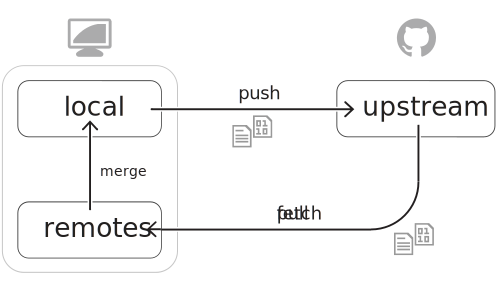


### Understanding version control











1. Launch Terminal or Git Shell
2. Check Git installation with `git --version`
3. Launch GitHub for Desktop


#### Objectives
* Understand the "distributed" aspect of Git version control
* Comprehend how *commit* objects serve as document change reference points
* Check that Git is installed and functioning on your system

#### Git key vocabulary & concepts
Three important words key to learning Git are:

* Repository
* Commit
* Branch

*Git is an open source distributed* version control system invented by Linus Torvalds in 2005.  It is used to version the Linux kernel and is shown to be, by some research, the most popular modern version control system.

Three important concepts of this version control system are:

* Distributed version control is the concept of full copies of the repository on every contributing machine
* Git is the file and information tracker
* GitHub is the collaboration platform

##### Deeper study
* [A short history of Git](http://git-scm.com/book/en/Getting-Started-A-Short-History-of-Git)
* [The Git project homepage](http://git-scm.com)
* [Entry-level videos from the official Git site](http://git-scm.com/videos)

##### Installers
The command line version of Git has a very light footprint. For most platforms, you can simply copy the binaries to a folder that is on the executable search $PATH. Git is primarily written in C, which means there is a unique installer for each operating system.

* **Windows**: [GitHub for Windows installer](http://windows.github.com)
* **Mac**: [GitHub for Mac installer](http://mac.github.com)
* **Linux**: Git's source code and a listing of supported package managers can be found [on the git-scm.com site](http://git-scm.com/download/linux).
* **Any platform**: [Pro Git Book: Installing Git](http://git-scm.com/book/en/Getting-Started-Installing-Git)

#### Videos

##### What is Git?
<iframe src="//player.vimeo.com/video/41381741" width="500" height="281" frameborder="0" webkitallowfullscreen mozallowfullscreen allowfullscreen></iframe>



### Surveying the GitHub platform







<span class="mega-octicon octicon-repo"></span>
#### Repositories



<span class="mega-octicon octicon-git-branch"></span>
#### Branches



<span class="mega-octicon octicon-git-pull-request"></span>
#### Pull Requests



<span class="mega-octicon octicon-issue-opened"></span>
#### Issues



<span class="mega-octicon octicon-jersey"></span>
#### Teams



<span class="mega-octicon octicon-organization"></span>
#### Organizations



* Describe the difference between the Git DVCS and GitHub collaboration platform
* Access the common project components of daily GitHub interactions
* Utilize project management components (Issues, Milestones, Collabortors, Teams)
* Recognize best document types for version control (code, CSV/TSV, small binaries)



#### Core concepts
The six core concepts in the GitHub ecosystem are:

* **Repository**: a location to store related code and files
* **Branch**: a named variation on the code or enhancement-in-progress
* **Pull Request**: discussion associated with a branch
* **Issues**: an integrated bug and enhancement tracker
* **Organizations**: groups of repositories and team members
* **Teams**: named sets of users that grant access levels and group by talent, focus, and reporting

#### Feature overview
* Hosting repositories
* Collaborating on code, documents, text
* Controlling access & contributions
  * Permissions
  * Forks
  * Users
  * Organizations
* Tracking assignments, tickets, bugs
* Hosting supporting documentation (GH-Pages)
  * https://pages.github.com/
* Discovering trending technology (Explore)
  * https://github.com/explore
* Tracking favorite projects (Stars)
  * https://github.com/stars
* Notifications
* Watching repositories
* Unsubscribing (per thread)
* Subscribing (per thread)
* Starring repositories
* Gist
  * Repos in themselves
  * Embeddable (use with GH-pages content)
* GitHub Flavored Markdown
  * Basics
  * Emoji
  * Checklists (Issues, Gists)
* Cross referencing
* Commit referencing
* Issue references
* cross-repo refs org|user/repo#num
* `README.md` in any folder level
* `CONTRIBUTING.md` in root

#### Details & resources
GitHub accounts are free. Sign up for one at [github.com/join](https://github.com/join).

GitHub is the repository hosting, collaboration, deployment, and distribution platform for both open source and private software projects.  It facilitates discussing changes-in-progress through the concepts of Issues and Pull Requests and provides a web user interface to much of Git. The web flow made possible by GitHub brings a much wider range of contributors, including documentation specialists, designers, and ops engineers into the flow of contributing to your application's life cycle.

GitHub accounts are free for an unlimited quantity of public repositories. Only private repositories cost to host on the service. Private repositories are typically used for closed-source consulting client or corporate products, whereas public repositories are typically used for open source.

Sign up for a free GitHub account at [github.com/join](https://github.com/join).

* [GitHub.com feature list](https://github.com/features)
* [How to sign up for GitHub](https://www.youtube.com/watch?v=ezxRcdJ8glM&list=PLg7s6cbtAD17rhrz2BJWAPJMjR71B3IDx)

#### Videos

##### GitHub account creation video
<iframe src="//player.vimeo.com/video/88472085" width="500" height="281" frameborder="0" webkitallowfullscreen mozallowfullscreen allowfullscreen></iframe>



### Creating a hosted repository



* Visit GitHub.com
* Click the `+`
* Name the repository
* Choose seed files
* Discuss ways of interaction


#### Details
Repositories can be created in numerous ways, including:

* With the GitHub web user interface
* With a GitHub GUI
* With `git init` at the command line

And important decision when creating your repository is in its name. Giving it a human readable, quick-to-identify, and sensible name makes it most effective and efficient for both yourself, and your colleagues to understand.



### Touring content versioning on GitHub



1. Browse to one of your repositories
2. Create file(s) and commit the new content
3. Edit an existing file's content and commit the change
4. Remove a file and commit the removal
5. Change a filename and commit the path change
6. Examine the *Commits* page of change history


#### Details
The GitHub web interface allows you to interact and perform many file-affecting actions directly through your browser:

* Browse projects
* Start branches
* Create files
* Edit content
* Change paths
* Open Pull Requests



### Acquiring repositories locally





* Version new or modified files via graphical client
* Prepare and preserve changes with command line

```
git status
git add [file]
git commit -m"[description]"
```


#### Objectives
* Clone from web (Clone in Desktop button)
* Clone via personal repo list in GitHub Desktop
* Clone via SSH or HTTPS URL

#### Details
A commit is a transactionally grouped set of changes, described by a brief message explaining the "why" of the attached changes.

Git enables repositories to be created both on GitHub, or locally on a developer's computer. A repository created locally can be synced to a network destination at a later time, preserving all the timestamps and comments in the local commits during the synchronization.

Since Git facilitates making and saving changes without a network connection, syncing changes with an upstream server is a frequent operation once connected back to a network.  Git accomplishes the syncing through the `pull` and `push` commands.

A repository must have fully incorporated all upstream changes before it can successfully push changes out. This pattern encourages breakages to happen at the leaf nodes of the repository network, thus reducing stop-work merge activity and aiding those tasks being performed asynchronously and potentially even offline.

To retrieve all upstream changes, and then transmit all local changes, type:

```shell
$ git pull
$ git push origin [master|branch]
```

Local repositories offer several benefits: You can initialize repositories while disconnected from network, you can craft file versions at your own pace or needing to publish changes one at a time, and you can create branches to isolate experiments in moments and exclusive to your development system.

Just as with the Git technology operating on GitHub, local repositories also two identical aspects: Commits, which serve as history marker for file(s) and change(s) with a record of author, time, and message; and branches which serve as a container for grouped commits, making simpler means to integrate change
with cleaner code review possibilities.



### Exploring the GitHub Flow





1. Create a branch and make commits to it
2. Notice the notification bar on the repository home page
3. Open a *Compare and Pull Request*
4. Facilitate team or colleage code review


#### Details
The GitHub Flow is a path through the GitHub user interface that facilitates governed, named, and reviewed sets of changes. This flow can be performed entirely from a web browser, with no need to download the code to a desktop machine, and yet still have the benefit of syntax highlighting and pre-merge code reviews and discussions.

A branch is a divergent path in the history of the code base. It may contain an experiment, fix, or enhancement, and is generally intended to be merged back to the `master` branch after being thoroughly reviewed by a colleague.

#### Videos
<iframe src="//player.vimeo.com/video/100128962" width="500" height="281" frameborder="0" webkitallowfullscreen mozallowfullscreen allowfullscreen></iframe>



### Contributing with Pull Requests







1. Create a Fork of a repository needing contributions
2. Follow the contribution pattern of the GitHub Flow
3. Submit a Pull Request and iterate with progressive commits


#### Resources
* [Guide to Forking](https://guides.github.com/overviews/forking/)



### Syncing local and GitHub repos







1. Make commits on GitHub repository
2. Clone in Desktop (if repository does not yet exist locally)
3. Review the changes locally
4. Make commits on local repository
5. Understand local history versus remote/GitHub
6. Publish (`push`) the changes
7. Review the changes on GitHub


#### Details
In many cases, working with a code project means retrieving it to the local disk so that you can leverage your language-specific IDE when making changes. To retrieve a repository to the local disk is to `clone` it, in Git parlance. 

Optionally, the process of synchronizing can be done on the command line, in addition to graphical clients like [GitHub for Windows](https://windows.github.com) and [GitHub for Mac](https://mac.github.com):

```
## Retrieve GitHub changes
git pull origin [master|branch]

## Publish local changes
git push origin [master|branch]
```



### GitHub Pages




### Managing project




### Using GitHub Flavored Markdown


