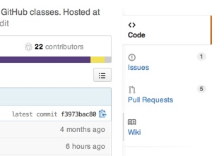
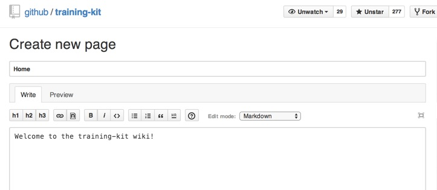

 

This curriculum will be your companion to the GitHub Foundations class taught by the GitHub Training Team and other educational groups. In this course, you'll learn basic collaboration skills towards a productive use of Git and GitHub in your open source work and daily job assignments.

### 1 – The Git VCS
__Git is an open source distributed__ version control system invented by Linus Torvalds in 2005.  It is used to version the Linux kernel and is shown to be, by some research, the most popular modern version control system.

Git is the open source, command line tool that forms a part of the workflows we'll cover in this course.  It has been called the successor to CVS and Subversion by many users, and maintains some similarity in behavior to these historical open source version control tools.

Maintaining a current version of Git is important. While you'll accurately hear that Git is generously backwards-compatible, the latest versions offer error message enhancements, performance tunings, and usability features that make using Git ever more quick and pleasant.

Verifying that Git is installed and operational can be done by requesting Git to display its current version using this command:

``` shell
$ git --version

git version 1.8.2
```

#### Git key vocabulary
Three important words that are key to learning Git are:

* Repository
* Commit
* Branch

#### Git key concepts
Three important concepts of this version control system are:

* Distributed version control is the concept of full copies of the repository on every contributing machine
* Git is the file and information tracker
* GitHub is the collaboration platform

../assets/diagrams/distributed-version-control.svg


#### Deeper study
* [A short history of Git](http://git-scm.com/book/en/Getting-Started-A-Short-History-of-Git)
* [The Git project homepage](http://git-scm.com)

#### Installers
The command line version of Git has a very light footprint. For most platforms, you can simply copy the binaries to a folder that is on the executable search $PATH. Git is primarily written in C, which means there is a unique installer for each operating system.

* **Windows**: [GitHub for Windows installer](http://windows.github.com)
* **Mac**: [GitHub for Mac installer](http://mac.github.com)
* **Linux**: Git's source code and a listing of supported package managers can be found [on the git-scm.com site](http://git-scm.com/download/linux).
* **Any platform**: [Pro Git Book: Installing Git](http://git-scm.com/book/en/Getting-Started-Installing-Git)

#### What is Git?
<iframe src="//player.vimeo.com/video/41381741" width="500" height="281" frameborder="0" webkitallowfullscreen mozallowfullscreen allowfullscreen></iframe>

### 2 – The GitHub Platform
GitHub accounts are free. Sign up for one at [github.com/join](https://github.com/join).

GitHub is the repository hosting, collaboration, deployment, and distribution platform for both open source and private software projects.  It facilitates discussing changes-in-progress through the concepts of Issues and Pull Requests and provides a web user interface to much of Git. The web flow made possible by GitHub brings a much wider range of contributors, including documentation specialists, designers, and ops engineers into the flow of contributing to your application's life cycle.

GitHub accounts are free for an unlimited quantity of public repositories. Only private repositories cost to host on the service. Private repositories are typically used for closed-source consulting client or corporate products, whereas public repositories are typically used for open source.

Sign up for a free GitHub account at https://github.com/join.

Git can be installed as a unified GitHub GUI and command line or merely as a stand-alone command line interface.

#### GitHub core concepts
The six core concepts in the GitHub ecosystem are:

* **Repository**: a location to store related code and files
* **Branch**: a named variation on the code or enhancement-in-progress
* **Pull Request**: discussion associated with a branch
* **Issues**: an integrated bug and enhancement tracker
* **Organizations**: groups of repositories and team members
* **Teams**: named sets of users that grant access levels and group by talent, focus, and reporting

The GitHub collaboration platform facilitates:

* Hosting Git repositories
* Collaborating on code, documents, 3D files, maps, CSV data
* Controlling access & contributions
  * Collaborators
  * Forks
  * Organizations
  * Users
* Tracking bugs, enhancements, and features via GitHub Issues
* [Hosting documentation via GitHub pages and a `gh-pages` branch](https://pages.github.com/)
* [Discovering trending technology via Explore](https://github.com/explore)
* [Tracking favorite projects via Stars](https://github.com/stars)

#### GitHub account creation video
<iframe src="//player.vimeo.com/video/88472085" width="500" height="281" frameborder="0" webkitallowfullscreen mozallowfullscreen allowfullscreen></iframe>

#### Resources
* [GitHub.com feature list](https://github.com/features)
* [How to sign up for GitHub](https://www.youtube.com/watch?v=ezxRcdJ8glM&list=PLg7s6cbtAD17rhrz2BJWAPJMjR71B3IDx)


### 3 – Repository creation
Repositories can be created in numerous ways, including:

* With the GitHub web user interface
* With a GitHub GUI
* With `git init` at the command line

../assets/diagrams/repo-clone.svg


#### Repository creation concepts
<!-- TODO -->
* Project access control (public/private)
* Repository creation
* Seed files (`README`, `.gitignore`, `license.md`)
* Edit/commit through web interface
* Concepts of hosted repository
* Repository based on existing content
* Web interface and GUI client
* Clone command explanation

#### Repository init-ing
<iframe src="//player.vimeo.com/video/88313612" width="500" height="281" frameborder="0" webkitallowfullscreen mozallowfullscreen allowfullscreen></iframe>


### 4 – Acquiring repos
In many cases, working with a code project means retriving it to the local disk so that you can leverage your language-specific IDE when making changes. To retrieve a repository to the local disk is to `clone` it, in Git parlance.  Some of the most common sources and means of cloning include:

* Clone from web (Clone in Desktop button)
* Clone via personal repo list in GitHub Desktop
* Clone via SSH or HTTPS URL

### 5 – The Web flow
The GitHub Web Flow is a path through the GitHub user interface that faciltates governed, named, and reviewed sets of changes. This flow can be performed entirely from a web browser, with no need to download the code to a desktop machine, and yet still having the benefit of syntax highlighting and pre-merge code reviews and discussions.

The GitHub Web Flow allows you to:

* Browse projects
* Start branches
* Create files
* Edit content
* Change paths
* Open Pull Requests

#### Drive by contributions
<iframe src="//player.vimeo.com/video/88472114" width="500" height="281" frameborder="0" webkitallowfullscreen mozallowfullscreen allowfullscreen></iframe>

### 6 – Local repositories
Git enables repositories to be created both on GitHub, or locally on a developer's PC. A repository created locally can be synced to a network destination at a later time, preserving all the timestamps and comments in the local commits during the synchronization.


A commit is a transactionally grouped set of changes, described by an brief message explaining the "why" of the attached changes.

../assets/diagrams/what-is-a-commit.svg


#### Local repository benefits
* Initialize repositories while disconnected from network
* Craft file versions at your own pace
* Create branches to isolate experiments

#### Local repository definitions
* Commits
  * History marker for file(s), change(s)
  * Record of author, time, and message
* Branches
  * Container for grouped commits
  * Simpler means to integrate change
  * Cleaner code review possibilities

### 7 – Syncing history
Since Git facilitates making and saving changes without a network connection, syncing changes with an upstream server is a frequent operation once connected back to a network.  Git accomplishes the syncing through the `pull` and `push` commands.

../assets/diagrams/sync.svg


A repository must have fully incorporated all upstream changes before it can successfully push changes out. This pattern encourages breakages to happen at the leaf nodes of the repository network, thus reducing stop-work merge activity and aiding those tasks being performed asynchronously and potentially even offline.

To retrieve all upstream changes, and then transmit all local changes, type:

```
$ git pull
$ git push origin [master|branch]
```

### 8 – Branches
A branch is an divergent path in the history of the code base. It may contain an experiment, fix, or enhancement, and is generally intended to be merged back to the `master` branch after being thoroughly reviewed by a colleague.


#### Branching video
<iframe src="//player.vimeo.com/video/100128962" width="500" height="281" frameborder="0" webkitallowfullscreen mozallowfullscreen allowfullscreen></iframe>

### 9 – Merges
Merging is the important step of integrating one branch with another.  In Git, since work can happen while disconnected from the network, frequently even the same-named branches might need to be merged with one another to unify the changes.  Merges come in several flavors, but we'll focus on the _merge made by recursive_ pattern in today's class.

../assets/diagrams/merge-recursive.svg


Merges can be accomplished through:
* Through a Pull Request
* At the command line
* With a drag-and-drop GUI such as GitHub Desktop

### 10 – Collaboration
Collaboration happens on GitHub in one of two primary workflows, based on whether the change is coming from someone new to the project, or from a frequent trusted contributor.

#### Forking
The Forking workflow allows for contributions from any read-authorized team member by facilitating the creation of a safe copy of the repository and offering changes back to a core maintainer upon submission of a Pull Request.

We've crafted a visual [Guide to Forking](https://guides.github.com/activities/forking/) that explains, in-depth:

* Reason for forks
* What forking encourages
* How forking insulates against unwanted changes
* Keeping forks up to date
* Concepts of an _Original_ (base) and _Fork_ (personal copy) repositories

../assets/diagrams/fork-structure.svg


#### The GitHub Flow
 The GitHub Flow workflow prescribes collaboration amongst trusted colleagues within the same repository, starting with the creation of a branch, and similar to the Forking workflow, concluding with a Pull Request and associated code review.

* Branch
* Commit
* Compare
* Pull Request
* Discuss
* Animated GIF
* Line by line code review
* Get approval :+1:
* Merge Pull Request
* Delete branch

../assets/diagrams/direct-contribution.svg


#### Resources
* [_Understanding The GitHub Flow_ Guide](https://guides.github.com/introduction/flow/)
* [_Forking_ Guide](https://guides.github.com/activities/forking/)

##### Lab Exercise 10a
* Begin the process of creating a new repository from the GitHub web site user interface
* When prompted, seed the new repository with a `README`, `.gitignore`, and `license.md` file
* Create and select a new branch named _my-home-town_
* Edit the README file through web interface, add your home town in H1 styling, and commit the change
* Navigate back to the root of the project and click on the _Create pull request_ button
* @mention a fellow student for a code review in the now-open Pull Request, asking for their :+1: to :shipit:
* When you have their blessing to ship the change, merge it in from the Pull Request page.
* Confirm the change is showing up in the rendered README at the homepage to the project.


### 11 – GitHub Pages
GitHub Pages are an easy-to-use static site hosting service based on the Jekyll blogging engine. It provides:

* Custom web pages for your GitHub project
* A custom web page for your GitHub account
* CDN-enabled fast delivery of static web content

#### Example GitHub Pages
* [NetFlix OSS](http://netflix.github.io)
* [Twitter OSS](http://twitter.github.io)
* [Facebook OSS](http://facebook.github.io)

#### Further reading
* [GitHub Pages](http://pages.github.com)

##### Lab Exercise 11a
* Create a new empty respository named `<yourgithubusername>.github.io`
* Click on the _Settings icon_
* From the _Options_ group, click on _Automatic page generator_ and follow the steps to create and style your new site
* Wait 10 minutes
* Confirm your new web site is up and running at `<yourgithubusername>.github.io`

### 12 – GitHub Wikis
GitHub Wikis are frequently used as the rich documentation for a project hosted on GitHub.  They offer:

* Fast documentation authoring
* Git repository access, for dedicated documentation clones and commits
* High visibility to repository guests

Enabling the Wiki feature:


Navigating to the project's Wiki:



Editing a Wiki page:




### 13 – Project Management
GitHub is a platform that offers features not only for developers, but also for project managers and technical leads. These features include:

* Issues
* [GitHub Flavored Markdown Task Lists](https://github.com/blog/1825-task-lists-in-all-markdown-documents)
* Milestones
* Network graph
* Pulse
* Tags and Releases
* Collaborator access control
* Organization repository grouping
* Team access control
* Team @mentions

##### Lab Exercise 13a
* Find an open source project via the [Explore page](https://github.com/exlpore)
* Review your chosen project's Pulse page and indentify this week and this year's most prolific contributor
* Visit the project's Releases page and download the latest binary


### 14 – GitHub Visualizations
GitHub enhances a traditional Git experience with visualizations typically thought of as the realm of desktop applications. Some of the visualizations we can look at today include:

* Comparing/Diff-ing
  * Code
  * Prose
  * Images
  * Maps
  * Spreadsheets
  * 3D models
* Branch view
* Branch ahead/behind positions
* Network graph
* Activity graph

#### Image Diff
Image diffing is typically thought of as a desktop-oriented feature. However, GitHub aims to be a web application that performs beyond desktop apps, and provides a rich 2-up, swipe, and onion skin view for changed images.

* [Image diff blog post](https://github.com/blog/817-behold-image-view-modes)
* [Image diff demo from Cameron](https://github.com/cameronmcefee/Image-Diff-View-Modes/commit/8e95f70c9c47168305970e91021072673d7cdad8)
* [Image diff demo from GitHub School](https://github.com/githubschool/hellogitworld/commit/7c0ffa9d88616972bb84befbec40a2212478149e)

Similarly, 3D file viewing, and then 3D file diffing are also part of the GitHub platform, providing a surprisingly rich experience right in the browser.

* [3D file viewing blog post](https://github.com/blog/1465-stl-file-viewing)
* [3D view demo of a RepRap part](https://github.com/reprap/huxley/blob/master/alternative-parts/x-blunt-plate-extended.stl)
* [3D file diffing blog post](https://github.com/blog/1633-3d-file-diffs)

### GitHub Social Features
* Notifications
* Watching repositories
* Starring repositories
* Quick sharing with [Gists](https://gists.github.com)


### Markdown
The realm of writing prose, which is increasingly important to software development, is moving towards more plaintext formats. A leading 
* GitHub Flavored Markdown
  * Basics
  * Emoji
  * Checklists (Issues, Gists)


### Special Filenames
There are several filenames that invoke a special behavior on the GitHub platform. These include:

* `Contributing.md`
* `License.md`
  * During repository creation
  * `+` a file with existing repository (special dropdown)
* `.gitignore`
  * During repository creation
  * `+` a file with existing repository (special dropdown)
* `Readme.md`
  * In root
  * In subfolders


### Keyboard Shortcuts
GitHub, though it is a web application, aims to behave as much like a desktop app as possible. Many of its features are accessible via keyboard shortcuts. While on any GitHub page, press `?` and a context-sensitive help menu will appear. Some of the most frequently used keyboard shortcuts include:

* `?` help
* `/` command bar
* `t` fuzzy file search
* `s` set focus to the search box
* `g` `c` go to code
* `g` `i` go to issues
