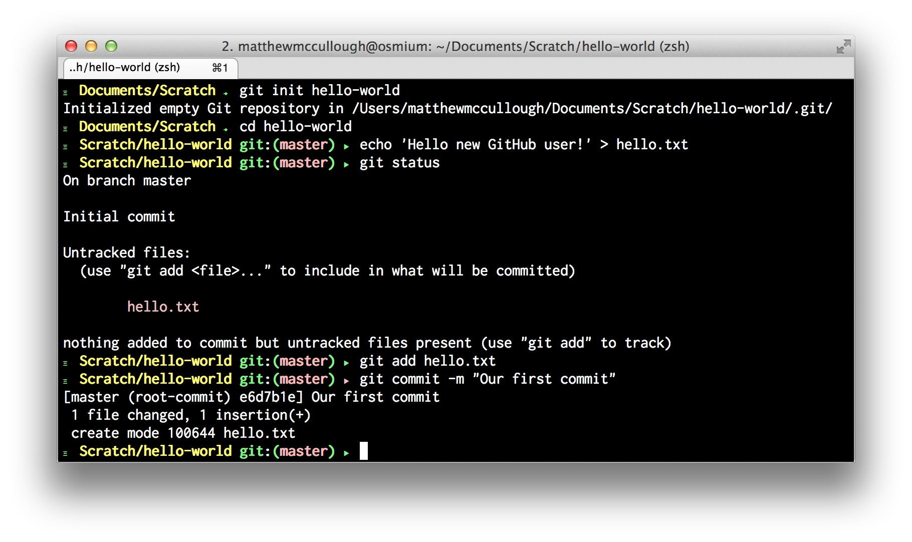
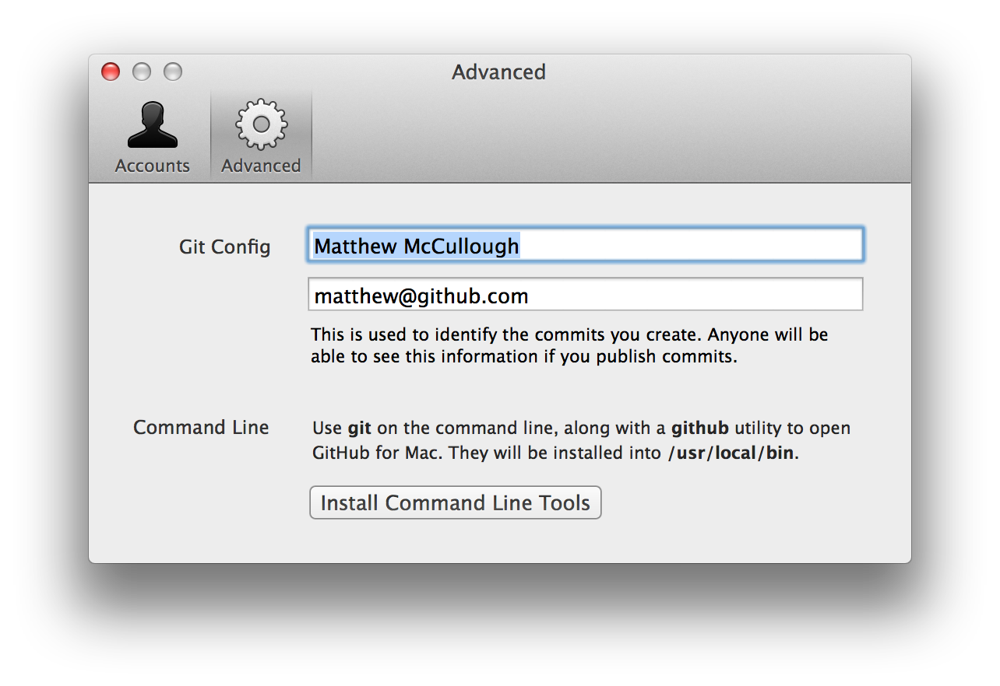
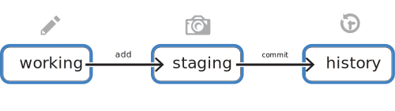
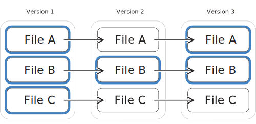
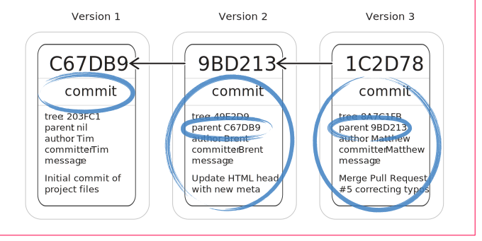
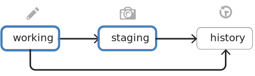
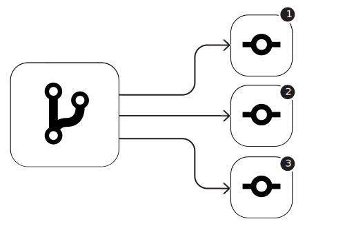
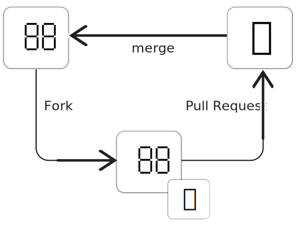
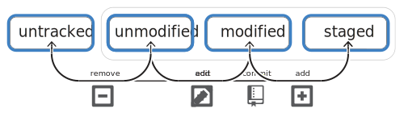

This curriculum will be your companion to the GitHub Intermediate class taught by the GitHub Training Team and other educational groups. In this course you'll learn how to extensively leverage Git and GitHub from the command line.




### Git Configuration





Some configuration options have become defaults over time:

```shell
# Enable use of color in output for Git versions older than 1.8.x
$ git config --[scope] color.ui auto
```

##### Line endings
The line ending setting is one of the most common settings users choose to set early in their use of Git. Some Git configuration options, like this one, affect platform-targeted behavior:

```shell
# Set line endings to LF for Mac and Linux
$ git config --[scope] core.autocrlf input
```

```shell
# Set line endings to CRLF for Windows
$ git config --[scope] core.autocrlf true
```

```shell
# List all inherited configuration
$ git config --list
```



### Start a repository





### Versioning content



#### Three stage thinking


#### Commit versions


#### Commit DAG


#### Video
<iframe src="//player.vimeo.com/video/88315552" width="100%" height="350" frameborder="0" webkitallowfullscreen mozallowfullscreen allowfullscreen></iframe>


### Review pending modifications



Git advocates precision in each commit's contents and commit message.  This is facilitated by easy reviewing of in-flight changes prior to describing them and making them permanent.



The simplest invocation of `diff` is the most common. It displays the difference of the files that have been modified.

```shell
$ git diff
```

Git also creates a distinction between what is modified and unselected and what has been staged for commit. A single `diff` option switch allows for the inspection of each of these two groups of changes.

```shell
$ git diff --staged
```

The default line-level difference indicators are sometimes insufficient for prose and small variable-name changes. There is, however, an option to instruct Git to perform and highlight intra-line comparisons.

```shell
# Highlight word changes on lines
$ git diff --color-words
```

Diff, by default, performs comparisons on all modified files. If inspection of just a subset is called for, `diff` accepts a precise or wildcard-ed filename or path as an option.

```shell
# By specific file
$ git diff [file-path]
```

#### Video
<iframe src="//player.vimeo.com/video/88315553" width="100%" height="350" frameborder="0" webkitallowfullscreen mozallowfullscreen allowfullscreen></iframe>


### Review historical changes



Git can look back at the history of each commit to see when a change took place, who made the change, or what the change contained.

```shell
$ git log
```

Some simple option flag additions to the `log` command can make the output more concise.

```shell
# Simple commit summaries
$ git log --oneline
```

And if displaying the full contents of the change and word-level comparison are helpful, there are option switches for that too.

```shell
# Option switches common with `diff`
$ git log --patch --color-words
```

#### Video
<iframe src="//player.vimeo.com/video/95811891" width="100%" height="350" frameborder="0" webkitallowfullscreen mozallowfullscreen allowfullscreen></iframe>


### Local workflows




Organizing history:





### Distributed repositories



Acquiring a repo:

```shell
$ git clone [repository-url]
```



### Remote workflows








### Shortcuts and custom commands





### File lifecycle








### Undoing changes





### Recovering anything




