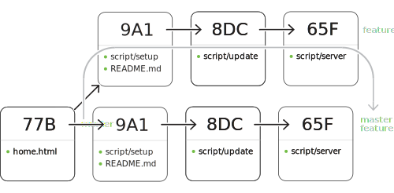
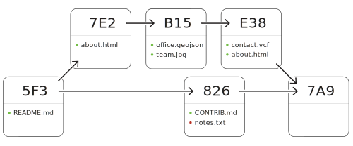

 

This curriculum will be your companion to the GitHub Intermediate class taught by the GitHub Training Team and other educational groups. In this course, you'll learn how to extensively leverage Git and GitHub from the command line.

### Git Configuration
Git is configured through name-value pairs saved in an [INI file format](http://en.wikipedia.org/wiki/INI_file). The name-value pairs can be read and written through the `git config` command.

The very first Git elements often suggested to set are the user's name and email address. If not set, Git will fall back to an automatically derived name and email from the host machine's network node name.

```bash
$ git config user.name "[your full name]"
$ git config user.email "[youremail@yourdomain.country]"
```

If using the GitHub for Windows or GitHub for Mac GUIs, these values are set, system-wide, by each GUI's configuration dialog.


Configuration scopes:

```bash
$ git config --system [name] [value]
$ git config --global [name] [value]
$ git config --local [name] [value]
```

Listing configuration:

```bash
$ git config --list --[scope] 
```


```bash
# Enable automatic use of color coding in output in older versions of Git
$ git config --[scope] color.ui auto
```


```bash
# Enable line ending conversions
$ git config --[scope] core.autocrlf [input|true]
```

#### Further reading
* [Book chapter on Configuring Git](http://git-scm.com/book/en/Customizing-Git-Git-Configuration)
* [Git documentation on the config command](http://git-scm.com/docs/git-config)

##### Lab: Configuration

1. Verify the current value of your username and email address as known by Git.
2. If needed, set your username and email address using the `git config` command.
3. If on Windows, set your line ending behavior to `core.autocrlf true`
4. If on Mac, set your line ending behavior to `core.autocrlf input`
5. List out all your remaining Git configuration values.

### Start a repository
Git provides an easy way to get started versioning any prototype, prose or project with a terse command line recipe.

Initialize a repository and create a top level project directory:

```bash
# For a new project...

$ git init newproject
$ cd newproject

# ...start coding
```

Initialize a repository inside a top level project directory:

```bash
# For an existing project...

$ cd existingproject
$ git init

# ...start coding
```

Acquire a project:

```bash
$ git clone [repository-url]
```

### Versioning content

```bash
$ git status
```


```bash
$ git add [filename]
```

```bash
$ git commit -m "[your description]"
```


### Review pending modifications
Git advocates precision in each commit's contents and commit message.  This is facilitated by easy reviewing of in-flight changes prior to describing them and making them permanent.


The simplest invocation of `diff` is the most common.  It displays

```bash
$ git diff
```

Git creates a distinction between what is modified and unselected and what has been staged for commit. A well-named `diff` option switch allows for the inspection of each of these two groups of changes.

```bash
$ git diff --staged
```

The default line-level difference indicators are sometimes insufficient for prose and small variable-name changes. An option instructs Git to perform and highlight intra-line comparisons.

```bash
# Highlight word changes on lines
$ git diff --color-words
```

Diff, by default, performs comparisons on all modified files. If inspection of just a subset is called for, `diff` accepts a precise or wildcard-ed filename or path as an option.

```bash
# By specific file
$ git diff [file-path]
```

### Review historical changes
Lorem ipsum dolor sit amet, vitae risus eu. Risus pede. Etiam facilisi quis, iaculis cum sed, eu mauris. Magna turpis. Etiam sed voluptatem.

```bash
$ git log
```

Some simple option flag additions to the `log` invocation can make the output more information-dense.

```bash
# Simple commit summaries
$ git log --oneline
```

And if displaying the full contents of the change and word-level comparision are helpful, there are option switches for that too.

```bash
# Option switches common with `diff`
$ git log --patch --color-words
```

### Local workflows

Organizing history:


Git branch:

```bash
# List branches, identify current brach
$ git branch

# Create a new branch from current branch
$ git branch [name]

# Switch to a different branch
$ git checkout [name]
```

Option switches:

```bash
# Rename any branch
$ git branch -m [current-name] [new-name]

# Delete a *reachable* branch
$ git branch -d [name]

# Delete whether or not reachable
$ git branch -D [name]
```

Git merge:

```bash
# Integrate history of specified branch into current one
$ git merge [branch]
```

Merge fast-forward:



Merge recursive:



### Distributed repositories


Git is capable of working with 0 to N remotes. 0 means the local repo only knows about the local file system, 1 represents a more traditional centralized model, and 1+N is an example of the "distributed" multi-mastered facet of a DVCS.

```bash
# List remote "bookmarks", if any
$ git remote
```

Additional remotes (bookmarks) are added as a name-URL-value pair. The default name, as established by a `clone` operation, is `origin`. Another common remote name is `upstream`, seen most frequently in Fork-and-Pull workflows.

```bash
# Add a remote "bookmark"
$ git remote add [name] [url]
```

### Remote workflows


Acquiring a repo:

```bash
$ git clone [repository-url]
```

#### Retrieval behavior configuration

Adjusting the `pull` to rebase any local changes on top of inbound ones from the upstream branch:

```bash
$ git config --[scope] pull.rebase true
```

Retrieving branch changes in discrete steps:

```bash
# Retrieve all remote branches, then list them
$ git fetch
$ git branch -a
```


#### Retrieving changes

If retrieval and incorporation are desired to happen in one action, `pull` is the appropriate command:

```bash
# Retrieve remote history and update working tree
$ git pull
```

If the goal is branch retrieval prior to disconnecting from a network, preserving the changes for later review and incorporation, use `fetch`:

```bash
# Only retrieve remote history
$ git fetch

$ git branch -r
```

Git also facilitates ad-hoc branch retrieval to `FETCH_HEAD` with or without a remote:

```bash
# Temporarily retrieve a repository's branch from a remote
$ git fetch [remote] [branch]
```

```bash
# Temporarily retrieve a repository's branch from a URL
$ git fetch [url] [branch]
```

#### Sharing changes

../assets/diagrams/network.svg


A fully-specified push can indicate both the destination and contents:

```bash
# Send branch's commit to specific remote
$ git push [remote] [branch]
```

If a push pattern for a given branch will be used frequently, `-u` instructs Git to remember the remote and branch association.

```bash
# Setup and publish branch's commits
$ git push -u [remote] [branch]
```

The most simplistic invocation of `push` leverages _tracking_ as set up by a `clone` or `push -u` to suggest which branches to transmit:

```bash
# Send any local commits to the tracking upstream branch
$ git push
```

### Shortcuts and custom commands

```bash
# Shortcut to output commit history
$ git config --global alias.l "log --oneline --stat"
```

```bash
# Quick graph of commit history and branches
$ git config --global alias.lol "log --graph --all --oneline --decorate"
```

```bash
# Shortuct to repository status
$ git config alias.s "status -s"
```

### File lifecycle
Files in Git transition through a well-defined states of tracking.

../assets/diagrams/states-of-tracking.svg


#### Adding files

```bash
# Stage all updated files
$ git add -u [file|pattern]
```

```
# Stage all files no matter the state
$ git add -A [file|pattern]
```

#### Removing files

When already tracked files are no longer needed, they can be removed from tracking and from the file system:

```bash
# Permanently delete file, stage for commit
$ git rm [file]
```

If there's a reason to preserve the file on disk after removing it from tracking, Git facilitates this behavior variant:

```bash
# Stop version tracking, stage for commit
$ git rm --cached [file]
```

#### Moving files

```bash
# Change the path of a file
$ git mv [path]
```

#### Reviewing moved files

```bash
# Show history including those with prior path names
$ git log --stat -M
```


### Undoing changes

#### Revert
Revert is the kindest of undo functionality. It creates a new _inverse_ commit and links back to the old one in the proposed commit message:

```bash
# Create a new commit undoing the patch in that specified
$ git revert [commit]
```

#### Reset

```bash
# Move current branch's HEAD to point in history
$ git reset [commit|branch|tag]
```

Reset offers a plethora of options to adjust the nuances of its restorative behavior:

```bash
# Move HEAD, keep changes in staging
$ git reset --soft [commit|branch|tag]

# Move HEAD, keep changes, clear staging area
$ git reset --mixed [commit|branch|tag]

## Move HEAD, discard all uncommited changes
$ git reset --hard [commit|branch|tag]
```

### Recovering anything

#### Reviewing historical states

```bash
$ git reflog
```

#### Restoring a historical state

```bash
$ git reset --[option] HEAD@{[n]}
```

#### Specific paths

```bash
$ git checkout HEAD@{[n]} -- [path]
```
