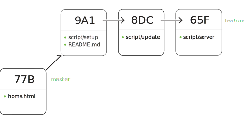
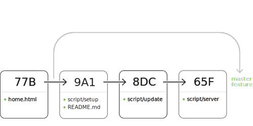
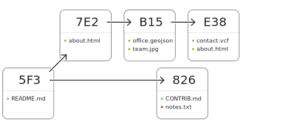
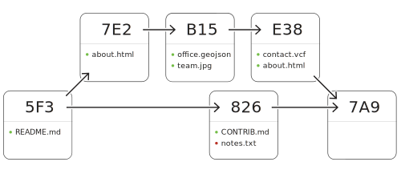
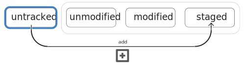
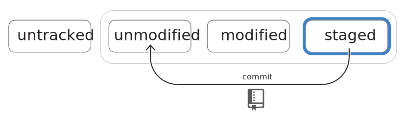
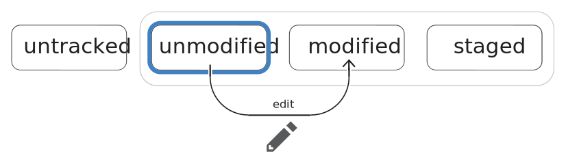
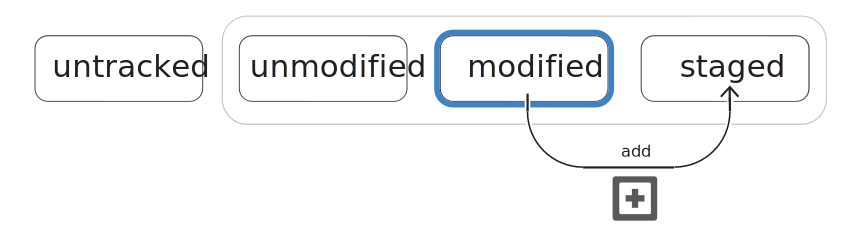


## Configuring your Git environment



1. Verify the current value of your username and email address as known by Git.
2. If needed, set your username and email address using the `git config` command.
3. If on Windows, set your line ending behavior to `core.autocrlf true`
4. If on Mac, set your line ending behavior to `core.autocrlf input`
5. List out all your remaining Git configuration values.


### Details
Git is configured through name-value pairs saved in an [INI file format](http://en.wikipedia.org/wiki/INI_file). The name-value pairs can be read and written through the `git config` command.

Git's configuration is saved in one of three plain text files and one of three levels and is easily editable with a text editor and portable to other machines by copying the configuration files.

#### Identity
Your name and email address are configured locally in Git and are attached to each commit. Set these accurately to receive proper attribution for your work.

These are the very first Git elements often suggested to set. If not set, Git will fall back to an automatically derived name and email from the host machine's network node name.

To inspect the current settings, individually query two configuration values:

```shell
$ git config user.name
Firstname Lastname

$ git config user.email
someaccount@example.com
```

If using the GitHub for Windows or GitHub for Mac GUIs, these values are set, system-wide, by each GUI's configuration dialog.

To set the same values to apply to *any* of your repositories:

```shell
$ git config --global user.name "your name"
$ git config --global user.email "your@email"
```

For a configuration specific to just the repository folder you're currently working in:

```shell
$ git config user.name "[your full name]"
$ git config user.email "[youremail@yourdomain.country]"
```

#### Scopes
Git configuration can be set at one of the three aforementioned levels.  The most common is `global`, and is used for all cross-repo but per-user settings.

Level | Precedence | Location
--- | --- | ---
`system` | lowest | alongside the `git` binary
`global` | middle | in your home directory as `.gitconfig`
`local` | highest | in your project's `.git/config` file

To use each of the scopes in a setting or getting action of `config`, simple provide the scope's name alongside the config action:

```shell
$ git config --system [name] [value]
$ git config --global [name] [value]
$ git config --local [name] [value]
```

#### Listing configuration
Listing the current configuration is as easy as asking for the entire set of name-value pairs:

```shell
# List all configuration for a given scope
$ git config --list --[scope]
```

#### Further reading
* [Pro Git Book: First Time Git Setup](http://git-scm.com/book/en/Getting-Started-First-Time-Git-Setup)
* [Book chapter on Configuring Git](http://git-scm.com/book/en/Customizing-Git-Git-Configuration)
* [Git documentation on the config command](http://git-scm.com/docs/git-config)

#### Video
<iframe src="//player.vimeo.com/video/88276099" width="500" height="350" frameborder="0" webkitallowfullscreen mozallowfullscreen allowfullscreen></iframe>



## Starting on the command line


### Details
Git provides an easy way to start versioning any prototype, prose or project with a terse command line recipe. Just initialize a local repository and create a top level project directory:

```shell
 For a new project...
$ git init [projectname]
$ cd [projectname]
```

Initialize a repository inside a top level project directory:

```shell
 For an existing project...
$ cd [existingprojectname]
$ git init
```

Acquire a project locally:

```shell
 Acquire with default repository name
$ git clone [repository-url]

 Acquire with preferred, optional name
$ git clone [url] [optional-folder-name]
```

### Video
<iframe src="//player.vimeo.com/video/88313612" width="500" height="350" frameborder="0" webkitallowfullscreen mozallowfullscreen allowfullscreen></iframe>



## Versioning via the command line











1. Create a new file and save it in the repository folder
2. Stage the file using the `add` command
3. Preserve the changes in history with the `commit` command


### Details
```shell
$ git status
$ git add [filename]
$ git commit -m "[your description]"
```

### Videos
<iframe src="//player.vimeo.com/video/88315552" width="500" height="350" frameborder="0" webkitallowfullscreen mozallowfullscreen allowfullscreen></iframe>



## Comparing pending and existing changes







1. Compare changes of modified files with respect to history
2. Compare staged modifications with respect to history
3. Compare unstaged changes to staged changes of the file


### Details
Git advocates precision in each commit's contents and commit message.  This is facilitated by easy review of in-flight changes prior to making them permanent.

The simplest invocation of `diff` is the most common. It displays the difference of the files that have been modified.

```shell
$ git diff
```

Git also creates a distinction between what is modified and unselected and what has been staged for commit. A single `diff` option switch allows for the inspection of each of these two groups of changes.

```shell
$ git diff --staged
```

The default line-level difference indicators are sometimes insufficient for prose and small variable-name changes. There is, however, an option to instruct Git to perform and highlight intra-line comparisons.

```shell
 Highlight word changes on lines
$ git diff --color-words
```

Diff, by default, performs comparisons on all modified files. If inspection of just a subset is called for, `diff` accepts a precise or wildcard-ed filename or path as an option.

```shell
 By specific file
$ git diff [file-path]
```

### Video
<iframe src="//player.vimeo.com/video/88315553" width="500" height="350" frameborder="0" webkitallowfullscreen mozallowfullscreen allowfullscreen></iframe>



## Reviewing historical changes



1. Review default commit history output
2. Refine history output with option switches
3. Isolate history listing by branch or starting point


### Details
Git can look back at the history of each commit to see when a change took place, who made the change, or what the change contained.

```shell
$ git log
```

Some simple option flag additions to the `log` command can make the output more concise.

```shell
 Simple commit summaries
$ git log --oneline
```

And if displaying the full contents of the change and word-level comparison are helpful, there are option switches for that too.

```shell
 Option switches common with `diff`
$ git log --patch --color-words
```

### Video
<iframe src="//player.vimeo.com/video/95811891" width="500" height="350" frameborder="0" webkitallowfullscreen mozallowfullscreen allowfullscreen></iframe>



## Organizing history for optimal workflows



















1. Create a topic branch from `master` or `gh-pages`
2. Change branches and understand where commits will be associated
3. Merge and combine histories of separate branches


### Details
Typical workflows always begin with a branch, no matter how small or grand the level of effort might be or the number of commits involved.

```shell
 List branches, identify current brach
$ git branch

 Create a new branch from current branch
$ git branch [name]

 Switch to a different branch
$ git checkout [name]
```

Option switches:

```shell
 Rename any branch
$ git branch -m [current-name] [new-name]

 Delete a *reachable* branch
$ git branch -d [name]

 Delete whether or not reachable
$ git branch -D [name]
```

The final step to bringing in the history of a branch into the current one is performed by merging it.

```shell
 Integrate history of specified branch into current one
$ git merge [branch]
```

### Videos
<iframe src="//player.vimeo.com/video/100127088" width="500" height="350" frameborder="0" webkitallowfullscreen mozallowfullscreen allowfullscreen></iframe>

<iframe src="//player.vimeo.com/video/100128962" width="500" height="350" frameborder="0" webkitallowfullscreen mozallowfullscreen allowfullscreen></iframe>



## Interacting with distributed repositories











1. Understand Fork repository model
2. Create your own Fork of any accessible repository
3. Submit Pull Requests from a Fork


### Details
Git is capable of working with 0 to N remotes. 0 means the local repo only knows about the local file system, 1 represents a more traditional centralized model, and 1+N is an example of the "distributed" multi-mastered facet of a DVCS.

```shell
 List remote "bookmarks", if any
$ git remote
```

Additional remotes (bookmarks) are added as a name-URL-value pair. The default name, as established by a `clone` operation, is `origin`. Another common remote name is `upstream`, seen most frequently in Fork-and-Pull workflows.

```shell
 Add a remote "bookmark"
$ git remote add [name] [url]
```

#### Retrieval behavior configuration

Adjusting the `pull` to rebase any local changes on top of inbound ones from the upstream branch:

```shell
$ git config --[scope] pull.rebase true
```

Retrieving branch changes in discrete steps:

```shell
 Retrieve all remote branches, then list them
$ git fetch
$ git branch -a
```

#### Retrieving changes
If retrieval and incorporation are desired to happen in one action, `pull` is the appropriate command:

```shell
 Retrieve remote history and update working tree
$ git pull
```

If the goal is branch retrieval prior to disconnecting from a network, preserving the changes for later review and incorporation, use `fetch`:

```shell
 Only retrieve remote history
$ git fetch

$ git branch -r
```

Git also facilitates ad-hoc branch retrieval to `FETCH_HEAD` with or without a remote:

```shell
 Temporarily retrieve a repository's branch from a remote
$ git fetch [remote] [branch]

 Temporarily retrieve a repository's branch from a URL
$ git fetch [url] [branch]
```

#### Sharing changes
A fully-specified push can indicate both the destination and contents:

```shell
 Send branch's commit to specific remote
$ git push [remote] [branch]
```

If a push pattern for a given branch will be used frequently, `-u` instructs Git to remember the remote and branch association.

```shell
 Setup and publish branch's commits
$ git push -u [remote] [branch]
```

The most simplistic invocation of `push` leverages _tracking_ as set up by a `clone` or `push -u` to suggest which branches to transmit:

```shell
 Send any local commits to the tracking upstream branch
$ git push
```



## Crafting shortcuts & efficiencies



1. Setup example aliases for command line effiency
2. Create your own Git command alias and option switch combination


### Details
```shell
 Shortcut to output commit history
$ git config --global alias.l "log --oneline --stat"
```

```shell
 Quick graph of commit history and branches
$ git config --global alias.lol "log --graph --all --oneline --decorate"
```

```shell
 Shortuct to repository status
$ git config alias.s "status -s"
```



## Understanding versioned file lifecycle























1. Understand the tracking states of new, modified, deleted, and renamed paths
2. Use the `rm` command to permanently delete files from future version control tracking
3. Use the `mv` command to relocate file paths and rename files
4. Apply the similarity-index concept to a real-world example
5. Stage any file state by the `add` command's option switches


### Details
Files in Git transition through a well-defined states of tracking.

#### Adding files
```shell
 Stage all updated files
$ git add -u [file|pattern]
```

```
 Stage all files no matter the state
$ git add -A [file|pattern]
```

#### Removing files
When already tracked files are no longer needed, they can be removed from tracking and from the file system:

```shell
 Permanently delete file, stage for commit
$ git rm [file]
```

If there's a reason to preserve the file on disk after removing it from tracking, Git facilitates this behavior variant:

```shell
 Stop version tracking, stage for commit
$ git rm --cached [file]
```

#### Moving files
```shell
 Change the path of a file
$ git mv [path]
```

#### Reviewing moved files
```shell
 Show history including those with prior path names
$ git log --stat -M
```

### Videos
<iframe src="//player.vimeo.com/video/97444896" width="500" height="350" frameborder="0" webkitallowfullscreen mozallowfullscreen allowfullscreen></iframe>

<iframe src="//player.vimeo.com/video/98954619" width="500" height="350" frameborder="0" webkitallowfullscreen mozallowfullscreen allowfullscreen></iframe>

<iframe src="//player.vimeo.com/video/99213354" width="500" height="350" frameborder="0" webkitallowfullscreen mozallowfullscreen allowfullscreen></iframe>



## Undoing any versioned changes



1. Use `revert` to generate a new commit undoing history
2. Understand the effects of `reset`


### Details
#### Revert
Revert is the kindest undo functionality. It creates a new _inverse_ commit and links back to the old one in the proposed commit message:

```shell
 Create a new commit undoing the patch in that specified
$ git revert [commit]
```

#### Reset
```shell
 Move current branch's HEAD to point in history
$ git reset [commit|branch|tag]
```

Reset offers a plethora of options to adjust the nuances of its restorative behavior:

```shell
 Move HEAD, keep changes in staging
$ git reset --soft [commit|branch|tag]

 Move HEAD, keep changes, clear staging area
$ git reset --mixed [commit|branch|tag]

# Move HEAD, discard all uncommitted changes
$ git reset --hard [commit|branch|tag]
```



## Recovering from anything



1. Understand the side effects of `reset` and discarding commit history
2. Using the `reflog` to review orphaned commits and past, local repo interactions
3. Applying `reflog` commit SHAs and the `reset` to recover lost commits


### Details
#### Reviewing historical states
```shell
$ git reflog
```

#### Restoring a historical state
```shell
$ git reset --[option] HEAD@{[n]}
```

#### Specific paths
```shell
$ git checkout HEAD@{[n]} -- [path]
```

#### Additional Resources
* [O'Reilly's Mastering Git video series](http://bit.ly/ogitvid)
* [Git and GitHub LiveLessons (Workshop)](http://www.informit.com/store/git-and-github-livelessons-workshop-9780133991772)


